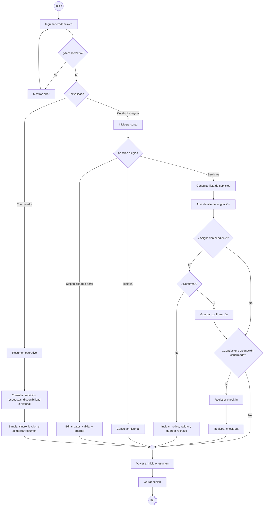

# Proyecto Lince


Aplicación móvil académica para consultar y responder asignaciones de servicios turísticos. Busca ordenar la información que hoy se reparte entre llamadas, mensajes y registros manuales.

**Api Avengers · Equipo 5 · Sección 3D**

## Estado del proyecto

Propuesta de MVP y diseño de interfaces. Las imágenes son referencias visuales; no representan una aplicación implementada ni conectada al sistema real de Southbound. Todos los ejemplos son ficticios. Identidad y pantallas pendientes de revisión final del equipo.

## Integrantes

| Integrante | Rol |
|---|---|
| Vicente Krausse | Coordinador |
| Luis Fermin | Diseñador |
| Jeremy Ibañez | Desarrollador |

Todos participan en las pruebas y documentación.

## Usuarios y funciones

- **Conductor:** consulta sus asignaciones, confirma o rechaza, informa disponibilidad y registra check-in/check-out.
- **Guía:** consulta sus servicios, responde asignaciones y actualiza disponibilidad y perfil.
- **Coordinador:** consulta servicios, respuestas, disponibilidad e historial, y un resumen con sincronización simulada.

El MVP incluye acceso con validación de rol, consultas y filtros básicos, respuestas validadas, disponibilidad, perfil ficticio, historial y ejecución del conductor. Las asignaciones y usuarios estarán precargados para el ejercicio. Quedan fuera la operación productiva, la asignación automática, el GPS en vivo, las notificaciones reales y los reportes avanzados.

## Identidad visual

Nombre: **Proyecto Lince**. El símbolo de lince representa atención y seguimiento; su centro alude a un punto de ruta. Se entrega en PNG transparente y SVG editable.

| Color | HEX | Uso |
|---|---|---|
| Principal | `#245B78` | Botones y elementos activos |
| Secundario | `#286B5D` | Estados confirmados |
| Fondo | `#F6F8FA` | Fondo general |
| Texto | `#172B3A` | Títulos y contenido |
| Error | `#BA1A1A` | Errores y rechazos |
| Superficie | `#E0EDF2` | Navegación e información secundaria |

Los estados usarán texto e iconos además de color. La propuesta emplea tarjetas, botones redondeados, campos etiquetados y navegación inferior para conductor y guía. La fuente del documento de evidencia conserva la del formato docente; las imágenes utilizan Arial como referencia visual, con Roboto previsto para Android.

## Flujo de usuario

Diagrama de actividad UML exportado como PNG:


Representación equivalente en Mermaid para visualizarla directamente en GitHub. El archivo editable está en [flujo-usuario.mmd](docs/diseno/flujo-usuario.mmd).



Los errores de formulario se muestran en la misma pantalla y deben corregirse antes de guardar. Cada respuesta conserva usuario, fecha y hora. Una asignación rechazada no puede iniciar ejecución; el check-out se habilita después del check-in. El diagrama muestra un recorrido que termina al cerrar sesión; las secciones pueden volver a utilizarse en recorridos posteriores.

## Pantallas principales

| Pantalla | Archivo | Componentes previstos |
|---|---|---|
| Inicio de sesión | [01-login.png](docs/diseno/interfaces/01-login.png) | OutlinedTextField, Button, Snackbar |
| Inicio | [02-inicio.png](docs/diseno/interfaces/02-inicio.png) | TopAppBar, Card, NavigationBar |
| Servicios | [03-servicios.png](docs/diseno/interfaces/03-servicios.png) | FilterChip, Card, OutlinedTextField |
| Detalle | [04-detalle.png](docs/diseno/interfaces/04-detalle.png) | Button, OutlinedButton, AlertDialog |
| Disponibilidad | [05-disponibilidad.png](docs/diseno/interfaces/05-disponibilidad.png) | DatePicker, Switch, Button |
| Perfil | [06-perfil.png](docs/diseno/interfaces/06-perfil.png) | OutlinedTextField, Button, Snackbar |
| Ejecución | [07-ejecucion.png](docs/diseno/interfaces/07-ejecucion.png) | Card, Button, TopAppBar |
| Historial | [08-historial.png](docs/diseno/interfaces/08-historial.png) | Card, TopAppBar |
| Variante de inicio para coordinación | [09-resumen-coordinacion.png](docs/diseno/interfaces/09-resumen-coordinacion.png) | Card, Button, TopAppBar |

Conductor y guía usan Inicio, Servicios, Agenda y Perfil en la NavigationBar. Historial se abre desde Inicio; detalle desde Servicios y ejecución desde el detalle de un servicio confirmado para el conductor. Coordinación dispone de su resumen con accesos a todos los servicios y al historial. La vista 09 es una variante por rol, no una pantalla nueva del alcance.

### Galería


## Tecnologías previstas

Android, Kotlin, Jetpack Compose y Material 3. Arquitectura MVVM, almacenamiento local y conexión a una API de prueba o simulada. Estas tecnologías están previstas para la implementación; esta entrega contiene análisis y diseño.

Referencias oficiales de diseño: [Material Design 3](https://m3.material.io/) y [componentes Material para Android](https://developer.android.com/design/ui/mobile/guides/components/material-overview).

## Organización

```text
Proyecto-lince/
├── README.md
└── docs/
    ├── evidencias/
    │   └── clase-02/
    │       └── Evidencia_Clase_02_Diseno_Equipo05.docx
    └── diseno/
        ├── logo.png
        ├── logo.svg
        ├── flujo-usuario-uml.png
        ├── flujo-usuario.mmd
        └── interfaces/
            └── 01-login.png … 09-resumen-coordinacion.png
```

La evidencia de clase 1 debe conservarse en `docs/evidencias/clase-01/` si ya está en el repositorio.

## Entrega de clase 2

- Documento completado y recursos visuales preparados con apoyo de Codex.
- Pendiente: selección y revisión final de identidad, flujo y pantallas por el equipo.
- Pendiente: incorporar los archivos y este contenido al README existente, conservando la información que ya tenga el proyecto.
- Pendiente: realizar el commit `docs: agrega flujo UML e interfaces del proyecto` y subirlo al repositorio.

